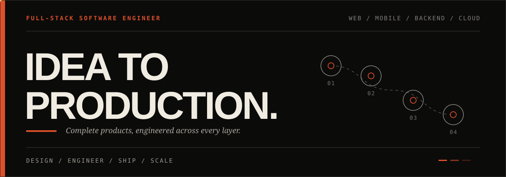
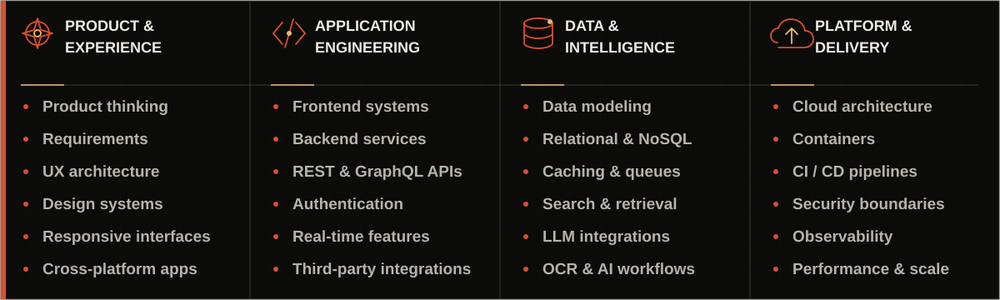

<!-- FULL-STACK EDITORIAL PROFILE / REVISION 07 -->

  &nbsp;·&nbsp;&nbsp;·&nbsp;&nbsp;·&nbsp;&nbsp;·&nbsp;  

##  01 / Profile
<table width="100%" align="center"><tr><td width="55%" valign="top"><h3>I build complete software products.</h3>
I'm <strong>Md. Rakibul Hasan Rana</strong>, a full-stack software engineer and Computer Science &amp; Engineering student at North South University in Dhaka, Bangladesh.

I work across the entire product lifecycle—from shaping an idea and designing its experience to engineering the frontend, backend, data layer, cloud infrastructure, and production delivery. I can enter at any layer, connect the whole system, and carry it through to a reliable release.
</td><td width="45%" valign="top"><strong>SCOPE</strong>   <strong>OWNERSHIP</strong>   <strong>STANDARD</strong> </td></tr></table>

##  02 / Engineering range

> I don't treat frontend, backend, infrastructure, and AI as separate islands. I engineer them as one product system—with clear contracts, deliberate trade-offs, and a consistent standard from interface to deployment.

##  03 / Technology
<table width="100%" align="center" cellpadding="12"><tr><td width="30%" nowrap="nowrap" valign="middle"><strong>LANGUAGES&nbsp;&amp;&nbsp;CORE</strong></td><td width="70%" align="left" valign="middle"></td></tr><tr><td width="30%" nowrap="nowrap" valign="middle"><strong>FRONTEND&nbsp;&amp;&nbsp;UI</strong></td><td width="70%" align="left" valign="middle"></td></tr><tr><td width="30%" nowrap="nowrap" valign="middle"><strong>MOBILE&nbsp;&amp;&nbsp;NATIVE</strong></td><td width="70%" align="left" valign="middle"></td></tr><tr><td width="30%" nowrap="nowrap" valign="middle"><strong>BACKEND&nbsp;&amp;&nbsp;APIs</strong></td><td width="70%" align="left" valign="middle"></td></tr><tr><td width="30%" nowrap="nowrap" valign="middle"><strong>DATA&nbsp;&amp;&nbsp;SERVICES</strong></td><td width="70%" align="left" valign="middle"></td></tr><tr><td width="30%" nowrap="nowrap" valign="middle"><strong>CLOUD&nbsp;&amp;&nbsp;PLATFORM</strong></td><td width="70%" align="left" valign="middle"></td></tr><tr><td width="30%" nowrap="nowrap" valign="middle"><strong>DEVOPS&nbsp;&amp;&nbsp;TOOLING</strong></td><td width="70%" align="left" valign="middle"></td></tr><tr><td width="30%" nowrap="nowrap" valign="middle"><strong>AI&nbsp;&amp;&nbsp;MACHINE&nbsp;LEARNING</strong></td><td width="70%" align="left" valign="middle"></td></tr></table>

##  04 / Activity

  

<strong>Contribution trail</strong>
 <picture><source media="(prefers-color-scheme: dark)" srcset="https://raw.githubusercontent.com/CodeCraftsmaniac/CodeCraftsmaniac/output/github-snake-dark.svg"><source media="(prefers-color-scheme: light)" srcset="https://raw.githubusercontent.com/CodeCraftsmaniac/CodeCraftsmaniac/output/github-snake.svg"></picture>

##  05 / Contact

 

<!-- Type scale: 14 metadata / 16–18 body / 22–24 component title / display hero. -->