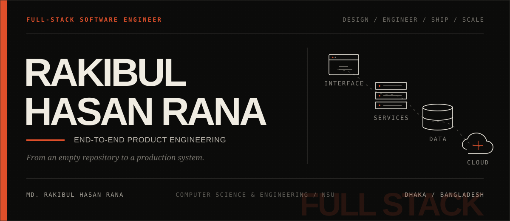
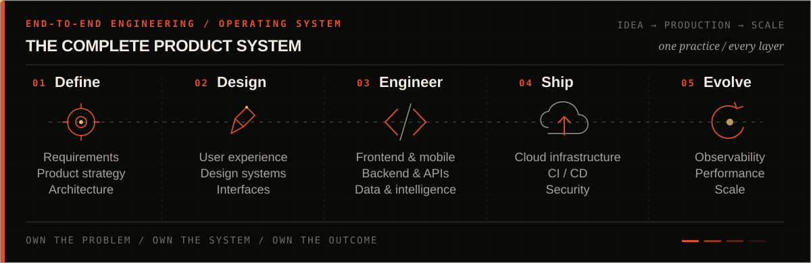

<!-- FULL-STACK EDITORIAL PROFILE / REVISION 05 -->

  &nbsp;·&nbsp;&nbsp;·&nbsp;&nbsp;·&nbsp;&nbsp;·&nbsp;

##  01 / Profile
<table><tr><td width="55%" valign="top"><h3>I build complete software products.</h3>
I'm <strong>Md. Rakibul Hasan Rana</strong>, a full-stack software engineer and Computer Science &amp; Engineering student at North South University in Dhaka, Bangladesh.

I work across the entire product lifecycle—from shaping an idea and designing its experience to engineering the frontend, backend, data layer, cloud infrastructure, and production delivery. I can enter at any layer, connect the whole system, and carry it through to a reliable release.
</td><td width="45%" valign="top">SCOPE   OWNERSHIP   STANDARD </td></tr></table>

##  02 / Engineering range
<table><tr><td width="25%" valign="top">PRODUCT &amp; EXPERIENCE  <strong>Product thinking Requirements UX architecture Design systems Responsive interfaces Cross-platform apps</strong></td><td width="25%" valign="top">APPLICATION ENGINEERING  <strong>Frontend systems Backend services REST &amp; GraphQL APIs Authentication Real-time features Third-party integrations</strong></td><td width="25%" valign="top">DATA &amp; INTELLIGENCE  <strong>Data modeling Relational &amp; NoSQL Caching &amp; queues Search &amp; retrieval LLM integrations OCR &amp; AI workflows</strong></td><td width="25%" valign="top">PLATFORM &amp; DELIVERY  <strong>Cloud architecture Containers CI / CD pipelines Security boundaries Observability Performance &amp; scale</strong></td></tr></table>

> I don't treat frontend, backend, infrastructure, and AI as separate islands. I engineer them as one product system—with clear contracts, deliberate trade-offs, and a consistent standard from interface to deployment.

##  03 / Technology

  

 
<table><tr><td align="center">LANGUAGES <strong>TypeScript · JavaScript Python · Dart · SQL</strong></td><td align="center">APPLICATIONS <strong>React · Next.js · Flutter Node.js · Express · FastAPI</strong></td><td align="center">DATA <strong>PostgreSQL · Supabase MongoDB · Redis · Prisma</strong></td><td align="center">PLATFORM <strong>Docker · GCP · Firebase Vercel · Cloudflare · GitHub Actions</strong></td></tr></table>

##  04 / Activity

  

<strong>Contribution trail</strong>
 <picture><source media="(prefers-color-scheme: dark)" srcset="https://raw.githubusercontent.com/CodeCraftsmaniac/CodeCraftsmaniac/output/github-snake-dark.svg"><source media="(prefers-color-scheme: light)" srcset="https://raw.githubusercontent.com/CodeCraftsmaniac/CodeCraftsmaniac/output/github-snake.svg"></picture>

##  05 / Contact

 

<!-- Art direction: Technical Monograph. Broad full-stack positioning; no featured-project hierarchy. -->